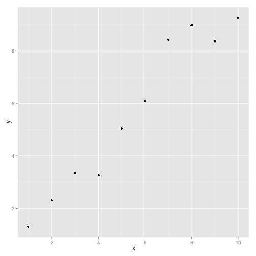
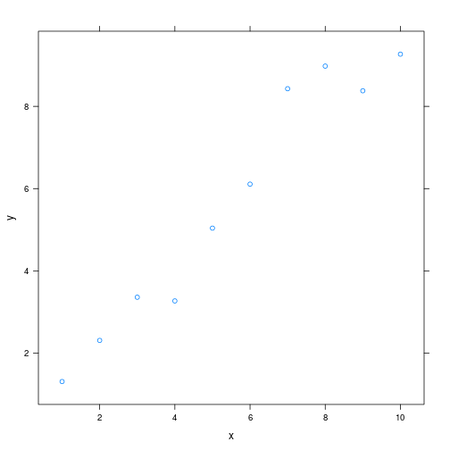

## Prepare for analyses


```r
set.seed(1234)
library(ggplot2)
library(lattice)
```


## Basic console output
The following R code chunk labelled `basicconsole` is as follows:


```r
x <- 1:10
y <- round(rnorm(10, x, 1), 2)
df <- data.frame(x, y)
df
```


```
##     x    y
## 1   1 1.31
## 2   2 2.31
## 3   3 3.36
## 4   4 3.27
## 5   5 5.04
## 6   6 6.11
## 7   7 8.43
## 8   8 8.98
## 9   9 8.38
## 10 10 9.27
```


## Plots
Images generated by `knitr` are saved in a figures folder. However, they also appear to be represented in the HTML output using a [data URI scheme]( http://en.wikipedia.org/wiki/Data_URI_scheme). This means that you can paste the HTML into a blog post or discussion forum and you don't have to worry about finding a place to store the images; they're embedded in the HTML.

### Simple plot
Here is a basic plot using base graphics:

    ```{r simpleplot}
    plot(x)
    ```


```r
plot(x)
```

 


Note that unlike traditional Sweave, there is no need to write `fig=TRUE`.


### Multiple plots
You can include multiple plots in one code chunk:


```r
boxplot(1:10 ~ rep(1:2, 5))
```

 

```r
plot(x, y)
```

 


### `ggplot2` plot
Ggplot2 plots work well:


```r
qplot(x, y, data = df)
```

 


### `lattice` plot
As do lattice plots:


```r
xyplot(y ~ x)
```

 


## R Code chunk features
### Create Markdown code from R
The following code hides the command input (i.e., `echo=FALSE`), and outputs the content directly as code (i.e., `results=asis`, which is similar to `results=tex` in Sweave).

Here are some dot points

* The value of y[1] is 1.31
* The value of y[2] is 2.31
* The value of y[3] is 3.36


### Create Markdown table code from R
x | y
--- | ---
1 | 1.31
2 | 2.31
3 | 3.36
4 | 3.27
5 | 5.04
6 | 6.11
7 | 8.43
8 | 8.98
9 | 8.38
10 | 9.27


### Control output display
The folllowing code supresses display of R input commands (i.e., `echo=FALSE`)
and removes any preceding text from console output (`comment=""`; the default is `comment="##"`).


```
  x    y
1 1 1.31
2 2 2.31
3 3 3.36
4 4 3.27
5 5 5.04
6 6 6.11
```


### Control figure size
The following is an example of a smaller figure using `fig.width` and `fig.height` options.

    ```{r smallplot, fig.width=3, fig.height=3}
    plot(x)
    ```


```r
plot(x)
```

 

