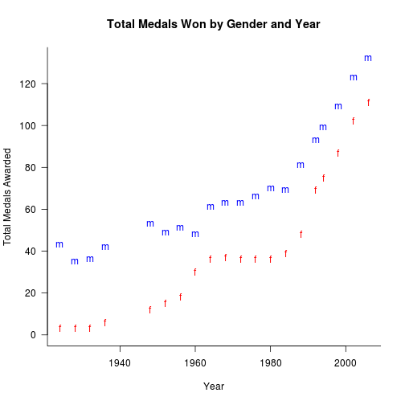
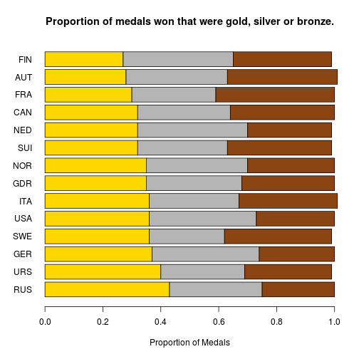

<!-- Title: How to Convert Sweave LaTeX to knitr R Markdown: Winter Olympic Medals Example -->

The following post shows how to manually convert a Sweave LaTeX document into a knitr R Markdown document. The post (1) reviews many of the required changes; (2) provides an example of a document converted to R Markdown format based on an analysis of  Winter Olympic Medal data up to and including 2006; and (3) discusses the pros and cons of LaTeX and Markdown for performing analyses.

<!-- more -->

# Overview
The following analyses of Winter Olympic Medals data have gone through several iterations:

1. **R Script**: I originally performed [similar analyses in February 2010](http://jeromyanglim.blogspot.com.au/2010/02/analysis-of-winter-olympic-medal-data.html). It was a simple set of commands where you could see the console output and view the plots. 
2. **LaTeX Sweave**: In February 2011 I adapted the example to make it a Sweave LaTex document. The [source fo this is available on github](https://github.com/jeromyanglim/Sweave_Winter_Olympics). With Sweave, I was able to create a document that weaved text, commands, console input, console output, and figures.
3. **R Markdown**: Now in June 2012 I'm using the example to review the process of converting a document from Sweave-LaTeX to R Markdown. The [souce code is available here on github](https://github.com/jeromyanglim/Winter_Olympic_Medals_R_Markdown) (see the `*.rmd` file). 


# Converting from Sweave to R Markdown
The following changes were required in order to convert my LaTeX Sweave document into an R Markdown document suitable for processing with `knitr` and `RStudio`. Many of these changes are fairly obvious if you understand LaTeX and Markdown; but a few are less obvious. And obviously there are many additional changes that might be required on other documents.


## R code chunks
* **R code chunk delimiters:** Update  from  `<< ... >>=` and `@` to R markdown format <code>&#96;&#96;&#96;{r ...}</code> and  <code>&#96;&#96;&#96;</code>
* **Inline code chunks:** Update from <code>&#92;Sexpr{...}</code> to either <code>&#96;r ...&#96;</code> or <code>&#96;r I(...)&#96;</code> format.
* **results=tex**: Any `results=tex` needs to either be removed or converted to `results='asis'`. Note that string values of knitr options need to be quoted.
* **Boolean options**: Sweave tolerates lower case `true` and `false` for code chunk options, `knitr` requires `TRUE` and `FALSE`.

## Figures and Tables
* **Floats**: Remove figure and table floats (e.g., `\begin{table}...\end{table}`, `\begin{figure}...\end{figure}`). In R Markdown and HTML, there are no pages and thus content is just placed immediately in the document.
* **Figure captions**: Extract content from within the `\caption{}` command. When using R Markdown, it is often easiest to add captions  to the plot itself (e.g., using the `main` argument in base graphics). 
* **Table captions:** extract content from within the `\caption{}` command; Table captions can be included in a `caption` argument using the `caption` argument to the `xtable` function (e.g., `print(xtable(MY_DAT_FRAME), "html", caption="MY CAPTION", caption.placement="top")` ). Caption placement defaults to `"bottom"` of table but can be optinally specified as `"top"` either as a global option or in `print.xtable`. Alternatively table titles can just be included as Markdown text.
* **References:** Delete table and figure lables (e.g., `\label{...}`). Replace table and figure references (e.g., `\ref{...}` with actual numbers or other descriptive terminology. It would also be possible to implement something simple in R that stored table and figure numbers (e.g., initialise table and figure numbers at the start of the document; increment table counter each time a table is created and likewise for figures; store the value of counter in variable; include variable in caption text using `paste()` or something similar. Include counter in text using inline R code chunks.
* **Table content**: Markdown supports HTML; so one option is to convert LaTeX tables to HTML tables using a function like `print(xtable(MY_DATA_FRAME), type="html")`. This is combined with the `results='asis'` R code chunk option.

## Basic formatting
* **Headings**: if we assume `section` is the top level: then `\section{...}` becomes `# ...`,  `\subsection{...}` becomes `## ...` and `\subsubsection{...}` becomes  `### ...`
* **Mathematics**: Update latex mathematics to `$``latex ...` and `$$``latex ... $$` notation if using RStudio.
* **Paragraph delimiters**: If using RStudio then remove single line breaks that were not intended to be paragraph breaks.
* **Hyperlinks**: Convert LaTeX Hyperlinks from `\href` or `url` to `[text](url)` format.

## LaTeX things
* **Comments**: Remove any LaTeX comments or switch from `% comment` to `<!-- comment -->`
* **LaTeX escaped characters**: Remove unnecessary escape characters (e.g., `\%` is just `%`).
* **R Markdown escaped characters**: Writing about the R Markdown language in R Markdown sometimes requires the use of HTML codes for special characters such as backticks (`&#96;`) and backslashes (`&#92;`) to prevent the text from being interpreted; see [here for a list of HTML character codes](http://www.ascii.cl/htmlcodes.htm).
* **Header**: Remove the LaTeX header information up to and including `\begin{document}`; extract any incorporate any relevant content such as title, abstract, author, date, etc.

# R Markdown Analysis of Winter Olympic Medal Data
The following shows the output of the actual analysis after running the rmd source through `Knit HTML` in Rstudio. If you're curious, you may wish to view the [rmd source code on GitHub side by side this point at this point](https://github.com/jeromyanglim/Winter_Olympic_Medals_R_Markdown/blob/master/Winter_Olympics.rmd).

## Import Dataset


```r
library(xtable)
options(stringsAsFactors = FALSE)
medals <- read.csv("data/medals.csv")
medals$Year <- as.numeric(medals$Year)
medals <- medals[!is.na(medals$Year), ]
```


The Olympic Medals data frame includes `2311` medals from `1924` to  `2006`.  The data was sourced from [The Guardian Data Blog](http://www.guardian.co.uk/news/datablog/2010/feb/11/winter-olympics-medals-by-country).


## Total Medals by Year


```r
# http://www.math.mcmaster.ca/~bolker/emdbook/chap3A.pdf
x <- aggregate(medals$Year, list(Year = medals$Year), length)
names(x) <- c("year", "medals")
x$pos <- seq(x$year)
fit <- nls(medals ~ a * pos^b + c, x, start = list(a = 10, b = 1, 
    c = 50))
```


In general over the years the number of Winter Olympic medals awarded has increased.  In order to model this relationship, year was converted to ordinal position.  A three parameter power function seemed plausible, $latex y = ax^b + c$, where $latex y$ is total medals awarded and $latex x$ is the ordinal position of the olympics starting at one.  The best fitting parameters by least-squares were

$$latex 
0.202 
x^{2.297 + 50.987}.
$$

The figure displays the data and the line of best fit for the model. The model predicts that 2010, 2014, and 2018 would have  `271`,  `295`, and `322` medals  respectively.
                      


```r
plot(medals ~ pos, x,  las = 1, 
		ylab = "Total Medals Awarded", 
		xlab = "Ordinal Position of Olympics",
        main="Total medals awarded 
     by ordinal position of Olympics with
     predicted three parameter power function fit displayed.",
		las = 1,
		bty="l")
lines(x$pos, predict(fit))
```

 

        

# Gender Ratio by Year


```r
medalsByYearByGender <- aggregate(medals$Year, list(Year = medals$Year, 
    Event.gender = medals$Event.gender), length)
medalsByYearByGender <- medalsByYearByGender[medalsByYearByGender$Event.gender != 
    "X", ]
propf <- list()
propf$prop <- medalsByYearByGender[medalsByYearByGender$Event.gender == 
    "W", "x"]/(medalsByYearByGender[medalsByYearByGender$Event.gender == "W", 
    "x"] + medalsByYearByGender[medalsByYearByGender$Event.gender == "M", "x"])
propf$year <- medalsByYearByGender[medalsByYearByGender$Event.gender == 
    "W", "Year"]
propf$propF <- format(round(propf$prop, 2))

propf$table <- with(propf, cbind(year, propF))
colnames(propf$table) <- c("Year", "Prop. Female")
```


The figure shows the number of medals won by males and  females by year. The table shows the proportion of medals awarded to females by year. It shows a generally similar pattern for males and females. Medals increase gradually until around the late 1980s after which the rate of increase accelerates. However, females started from a much smaller base. Thus, both the absolute difference and the percentage difference has decreased over time to the point where in 2006 `46` of medals were won by females.


```r
plot(x ~ Year, medalsByYearByGender[medalsByYearByGender$Event.gender == 
    "M", ], ylim = c(0, max(x)), pch = "m", col = "blue", las = 1, ylab = "Total Medals Awarded", 
    bty = "l", main = "Total Medals Won by Gender and Year")
points(medalsByYearByGender[medalsByYearByGender$Event.gender == 
    "W", "Year"], medalsByYearByGender[medalsByYearByGender$Event.gender == 
    "W", "x"], col = "red", pch = "f")
```

 


```r
print(xtable(propf$table,
             caption="Proportion of Medals that were awarded to Females by Year"), 
      type="html", 
      caption.placement="top",
      html.table.attributes='align="center"')
```

<!-- html table generated in R 2.15.1 by xtable 1.7-0 package -->
<!-- Wed Jul 18 11:36:58 2012 -->
<TABLE align="center">
<CAPTION ALIGN="top"> Proportion of Medals that were awarded to Females by Year </CAPTION>
<TR> <TH>  </TH> <TH> Year </TH> <TH> Prop. Female </TH>  </TR>
  <TR> <TD align="right"> 1 </TD> <TD> 1924 </TD> <TD> 0.07 </TD> </TR>
  <TR> <TD align="right"> 2 </TD> <TD> 1928 </TD> <TD> 0.08 </TD> </TR>
  <TR> <TD align="right"> 3 </TD> <TD> 1932 </TD> <TD> 0.08 </TD> </TR>
  <TR> <TD align="right"> 4 </TD> <TD> 1936 </TD> <TD> 0.12 </TD> </TR>
  <TR> <TD align="right"> 5 </TD> <TD> 1948 </TD> <TD> 0.18 </TD> </TR>
  <TR> <TD align="right"> 6 </TD> <TD> 1952 </TD> <TD> 0.23 </TD> </TR>
  <TR> <TD align="right"> 7 </TD> <TD> 1956 </TD> <TD> 0.26 </TD> </TR>
  <TR> <TD align="right"> 8 </TD> <TD> 1960 </TD> <TD> 0.38 </TD> </TR>
  <TR> <TD align="right"> 9 </TD> <TD> 1964 </TD> <TD> 0.37 </TD> </TR>
  <TR> <TD align="right"> 10 </TD> <TD> 1968 </TD> <TD> 0.37 </TD> </TR>
  <TR> <TD align="right"> 11 </TD> <TD> 1972 </TD> <TD> 0.36 </TD> </TR>
  <TR> <TD align="right"> 12 </TD> <TD> 1976 </TD> <TD> 0.35 </TD> </TR>
  <TR> <TD align="right"> 13 </TD> <TD> 1980 </TD> <TD> 0.34 </TD> </TR>
  <TR> <TD align="right"> 14 </TD> <TD> 1984 </TD> <TD> 0.36 </TD> </TR>
  <TR> <TD align="right"> 15 </TD> <TD> 1988 </TD> <TD> 0.37 </TD> </TR>
  <TR> <TD align="right"> 16 </TD> <TD> 1992 </TD> <TD> 0.43 </TD> </TR>
  <TR> <TD align="right"> 17 </TD> <TD> 1994 </TD> <TD> 0.43 </TD> </TR>
  <TR> <TD align="right"> 18 </TD> <TD> 1998 </TD> <TD> 0.44 </TD> </TR>
  <TR> <TD align="right"> 19 </TD> <TD> 2002 </TD> <TD> 0.45 </TD> </TR>
  <TR> <TD align="right"> 20 </TD> <TD> 2006 </TD> <TD> 0.46 </TD> </TR>
   </TABLE>


# Countries with the Most Medals


```r
cmm <- list()
cmm$medals <- sort(table(medals$NOC), dec = TRUE)
cmm$country <- names(cmm$medals)
cmm$prop <- cmm$medals/sum(cmm$medals)
cmm$propF <- paste(round(cmm$prop * 100, 2), "%", sep = "")

cmm$row1 <- c("Rank", "Country", "Total", "%")
cmm$rank <- seq(cmm$medals)
cmm$include <- 1:10

cmm$table <- with(cmm, rbind(cbind(rank[include], country[include], 
    medals[include], propF[include])))
colnames(cmm$table) <- cmm$row1
```


Norway has won the most medals with `280` (`12.12`%). The table shows the top 10.  Russia, USSR, and EUN (Unified Team in 1992 Olympics) have a combined total of `293`.  Germany, GDR, and FRG have a combined medal total of  `309`.


```r
print(xtable(cmm$table, caption="Rankings of Medals Won by Country"), 
      "html", include.rownames=FALSE, caption.placement='top',
      html.table.attributes='align="center"')
```

<!-- html table generated in R 2.15.1 by xtable 1.7-0 package -->
<!-- Wed Jul 18 11:36:59 2012 -->
<TABLE align="center">
<CAPTION ALIGN="top"> Rankings of Medals Won by Country </CAPTION>
<TR> <TH> Rank </TH> <TH> Country </TH> <TH> Total </TH> <TH> % </TH>  </TR>
  <TR> <TD> 1 </TD> <TD> NOR </TD> <TD> 280 </TD> <TD> 12.12% </TD> </TR>
  <TR> <TD> 2 </TD> <TD> USA </TD> <TD> 216 </TD> <TD> 9.35% </TD> </TR>
  <TR> <TD> 3 </TD> <TD> URS </TD> <TD> 194 </TD> <TD> 8.39% </TD> </TR>
  <TR> <TD> 4 </TD> <TD> AUT </TD> <TD> 185 </TD> <TD> 8.01% </TD> </TR>
  <TR> <TD> 5 </TD> <TD> GER </TD> <TD> 158 </TD> <TD> 6.84% </TD> </TR>
  <TR> <TD> 6 </TD> <TD> FIN </TD> <TD> 151 </TD> <TD> 6.53% </TD> </TR>
  <TR> <TD> 7 </TD> <TD> CAN </TD> <TD> 119 </TD> <TD> 5.15% </TD> </TR>
  <TR> <TD> 8 </TD> <TD> SUI </TD> <TD> 118 </TD> <TD> 5.11% </TD> </TR>
  <TR> <TD> 9 </TD> <TD> SWE </TD> <TD> 118 </TD> <TD> 5.11% </TD> </TR>
  <TR> <TD> 10 </TD> <TD> GDR </TD> <TD> 110 </TD> <TD> 4.76% </TD> </TR>
   </TABLE>


# Proportion of Gold Medals by Country
Looking only at countries that have won more than 50 medals in the dataset, the figure shows that the proportion of medals won that were gold, silver, or bronze.


```r
NOC50Plus <- names(table(medals$NOC)[table(medals$NOC) > 50])
medalsSubset <- medals[medals$NOC %in% NOC50Plus, ]
medalsByMedalByNOC <- prop.table(table(medalsSubset$NOC, medalsSubset$Medal), 
                                 margin = 1)
medalsByMedalByNOC <- medalsByMedalByNOC[order(medalsByMedalByNOC[, "Gold"], 
         decreasing = TRUE), c("Gold", "Silver", "Bronze")]
barplot(round(t(medalsByMedalByNOC), 2), horiz = TRUE, las = 1, 
		col=c("gold", "grey71", "chocolate4"), 
		xlab = "Proportion of Medals",
        main="Proportion of medals won that were gold, silver or bronze.")
```

 


# How many different countries have won medals by year?


```r
listOfYears <- unique(medals$Year)
names(listOfYears) <- unique(medals$Year)
totalNocByYear <- sapply(listOfYears, function(X) length(table(medals[medals$Year == 
    X, "NOC"])))
```


The figure shows the total number of countries winning medals by year.


```r
plot(x = names(totalNocByYear), totalNocByYear, ylim = c(0, max(totalNocByYear)), 
    las = 1, xlab = "Year", main = "Total Number of Countries Winning Medals By Year", 
    ylab = "Total Number of Countries", bty = "l")
```

 


# Australia at the Winter Olympics


```r
ausmedals <- list()
ausmedals$data <- medals[medals$NOC == "AUS", ]
ausmedals$data <- ausmedals$data[, c("Year", "City", "Discipline", 
    "Event", "Medal")]
ausmedals$table <- ausmedals$data
```


Given that I am an Australian I decided to have a look at the Australian medal count. Australia does not get a lot of snow.  Up to and including 2006, Australia has won  `6` medals. It won its first medal in  `1994`. Of the `6` medals,  `3` were bronze, `0` were silver, and `3` were gold.  The table lists each of these medals.


```r
print(xtable(ausmedals$table, 
             caption='List of Australian Medals',
             digits=0),
      type='html', 
      caption.placement='top', 
      include.rownames=FALSE,
      html.table.attributes='align="center"') 
```

<!-- html table generated in R 2.15.1 by xtable 1.7-0 package -->
<!-- Wed Jul 18 11:36:59 2012 -->
<TABLE align="center">
<CAPTION ALIGN="top"> List of Australian Medals </CAPTION>
<TR> <TH> Year </TH> <TH> City </TH> <TH> Discipline </TH> <TH> Event </TH> <TH> Medal </TH>  </TR>
  <TR> <TD align="right"> 1994 </TD> <TD> Lillehammer </TD> <TD> Short Track S. </TD> <TD> 5000m relay </TD> <TD> Bronze </TD> </TR>
  <TR> <TD align="right"> 1998 </TD> <TD> Nagano </TD> <TD> Alpine Skiing </TD> <TD> slalom </TD> <TD> Bronze </TD> </TR>
  <TR> <TD align="right"> 2002 </TD> <TD> Salt Lake City </TD> <TD> Short Track S. </TD> <TD> 1000m </TD> <TD> Gold </TD> </TR>
  <TR> <TD align="right"> 2002 </TD> <TD> Salt Lake City </TD> <TD> Freestyle Ski. </TD> <TD> aerials </TD> <TD> Gold </TD> </TR>
  <TR> <TD align="right"> 2006 </TD> <TD> Turin </TD> <TD> Freestyle Ski. </TD> <TD> aerials </TD> <TD> Bronze </TD> </TR>
  <TR> <TD align="right"> 2006 </TD> <TD> Turin </TD> <TD> Freestyle Ski. </TD> <TD> moguls </TD> <TD> Gold </TD> </TR>
   </TABLE>


# Ice Hockey


```r
icehockey <- medals[medals$Sport == "Ice Hockey" & medals$Event.gender == 
    "M" & medals$Medal == "Gold", ]
icehockeyf <- medals[medals$Sport == "Ice Hockey" & medals$Event.gender == 
    "W" & medals$Medal == "Gold", ]

# names(table(icehockey$NOC)[table(icehockey$NOC) > 1])
```


The following are some statistics about Winter Olympics Ice Hockey up to and including the 2006 Winter Olympics.  

* Out of the  `20`  Winter Olympics that have been staged,  Mens Ice Hockey has been held in  `20` and the Womens in `3`.
* The USSR has won the most mens gold medals with `7` golds. It goes up to `8` if the 1992 Unified Team is included. 
* Canada has the second most golds with  `6`. 
* After that the only two nations to win more than one gold are  Sweden (`2` golds) and the United States (`2` golds).
*  The  table shows the countries who won gold and silver medals by year.
* In the case of the Women's Ice Hockey, Canada has won `2` and the United States has won `1`.


```r
icehockeygs <- medals[medals$Sport == "Ice Hockey" & 
    medals$Event.gender == "M" &
    medals$Medal %in% c("Silver", "Gold"),  c("Year", "Medal", "NOC")]
icetab <- list()
icetab$data <- reshape(icehockeygs, idvar="Year", timevar="Medal",
    direction="wide")
names(icetab$data) <- c("Year", "Gold", "Silver")

print(xtable(icetab$data, 
             caption ="Country Winning Gold and Silver Medals by Year in Mens Ice Hockey", 
             digits=0), 
      type="html",     
      include.rownames=FALSE,
      caption.placement="top",
      html.table.attributes='align="center"')
```

<!-- html table generated in R 2.15.1 by xtable 1.7-0 package -->
<!-- Wed Jul 18 11:36:59 2012 -->
<TABLE align="center">
<CAPTION ALIGN="top"> Country Winning Gold and Silver Medals by Year in Mens Ice Hockey </CAPTION>
<TR> <TH> Year </TH> <TH> Gold </TH> <TH> Silver </TH>  </TR>
  <TR> <TD align="right"> 1924 </TD> <TD> CAN </TD> <TD> USA </TD> </TR>
  <TR> <TD align="right"> 1928 </TD> <TD> CAN </TD> <TD> SWE </TD> </TR>
  <TR> <TD align="right"> 1932 </TD> <TD> CAN </TD> <TD> USA </TD> </TR>
  <TR> <TD align="right"> 1936 </TD> <TD> GBR </TD> <TD> CAN </TD> </TR>
  <TR> <TD align="right"> 1948 </TD> <TD> CAN </TD> <TD> TCH </TD> </TR>
  <TR> <TD align="right"> 1952 </TD> <TD> CAN </TD> <TD> USA </TD> </TR>
  <TR> <TD align="right"> 1956 </TD> <TD> URS </TD> <TD> USA </TD> </TR>
  <TR> <TD align="right"> 1960 </TD> <TD> USA </TD> <TD> CAN </TD> </TR>
  <TR> <TD align="right"> 1964 </TD> <TD> URS </TD> <TD> SWE </TD> </TR>
  <TR> <TD align="right"> 1968 </TD> <TD> URS </TD> <TD> TCH </TD> </TR>
  <TR> <TD align="right"> 1972 </TD> <TD> URS </TD> <TD> USA </TD> </TR>
  <TR> <TD align="right"> 1976 </TD> <TD> URS </TD> <TD> TCH </TD> </TR>
  <TR> <TD align="right"> 1980 </TD> <TD> USA </TD> <TD> URS </TD> </TR>
  <TR> <TD align="right"> 1984 </TD> <TD> URS </TD> <TD> TCH </TD> </TR>
  <TR> <TD align="right"> 1988 </TD> <TD> URS </TD> <TD> FIN </TD> </TR>
  <TR> <TD align="right"> 1992 </TD> <TD> EUN </TD> <TD> CAN </TD> </TR>
  <TR> <TD align="right"> 1994 </TD> <TD> SWE </TD> <TD> CAN </TD> </TR>
  <TR> <TD align="right"> 1998 </TD> <TD> CZE </TD> <TD> RUS </TD> </TR>
  <TR> <TD align="right"> 2002 </TD> <TD> CAN </TD> <TD> USA </TD> </TR>
  <TR> <TD align="right"> 2006 </TD> <TD> SWE </TD> <TD> FIN </TD> </TR>
   </TABLE>


# Reflections on the Conversion Process
* Markdown versus LaTeX: 
     * I prefer performing analyses with Markdown than I do with LateX. 
     * Markdown is easier to type than LaTeX. 
     * Markdown is easier to read than LaTeX.
     * It is easier with Markdown to get started with analyses.
     * Many analyses are only presented on the screen and as such page breaks in LaTeX are a nuisance. This extends to many features of LaTeX such as headers, figure and table placement, margins, table formatting, partiuclarly for long or wide tables, and so on.
     * That said, journal articles, books, and other artefacts that are bound to the model of a printed page are not going anywhere. 
     * Furthermore, bibliographies, cross-references, elaborate control of table appearance, and more are all features which LaTeX makes easier than Markdown.
* R Markdown to Sweave LaTeX:
    * The more common conversion task that I can imagine is taking some simple analyses in R Markdown and having to convert them into knitr LaTeX in order to include the content in a journal article.
    * The first time I converted between the formats, it was good to do it in a relatively manual way to get a sense of all the required changes; however, if I had a large document or was doing the task on subsequent occasions, I would look at more automated solutions using string replacement tools (e.g., sed, or even just replacement commands in a text editor such as Vim), and markup conversion tools (e.g., pandoc).
    * Perhaps if the formats get popular enough, developers will start to build dedicated conversion tools.


# Additional Resources
If you liked this post, you may want to subscribe to the [RSS feed of my blog](http://feeds.feedburner.com/jeromyanglim). Also see:
* This post on [Getting Started with R Markdown, knitr, and Rstudio 0.96](http://jeromyanglim.blogspot.com/2012/05/getting-started-with-r-markdown-knitr.html)
* This post for another [Example Reproducible Report using R Markdown which analyses California Schools Test Data](http://jeromyanglim.blogspot.com/2012/05/example-reproducile-report-using-r.html)
* These [Assorted posts using Sweave](http://jeromyanglim.blogspot.com.au/search/label/Sweave)
* The [knitr](http://yihui.name/knitr/) home page and [knitr options page](http://yihui.name/knitr/options).
* the [xtable LaTeX table gallery](http://cran.r-project.org/web/packages/xtable/vignettes/xtableGallery.pdf) which can also be used to generate HTML tables for inclusion in Markdown.
